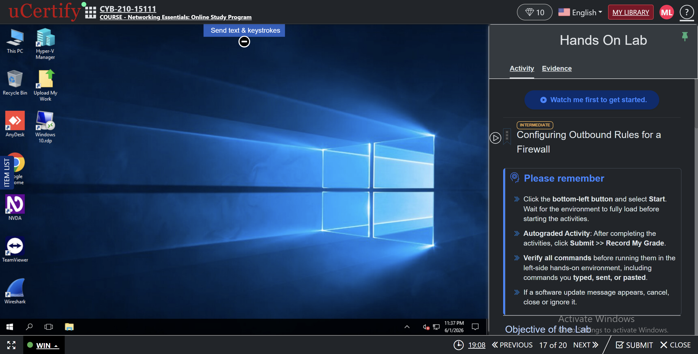
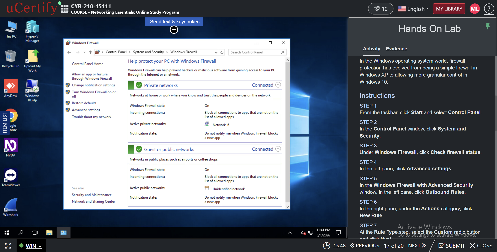
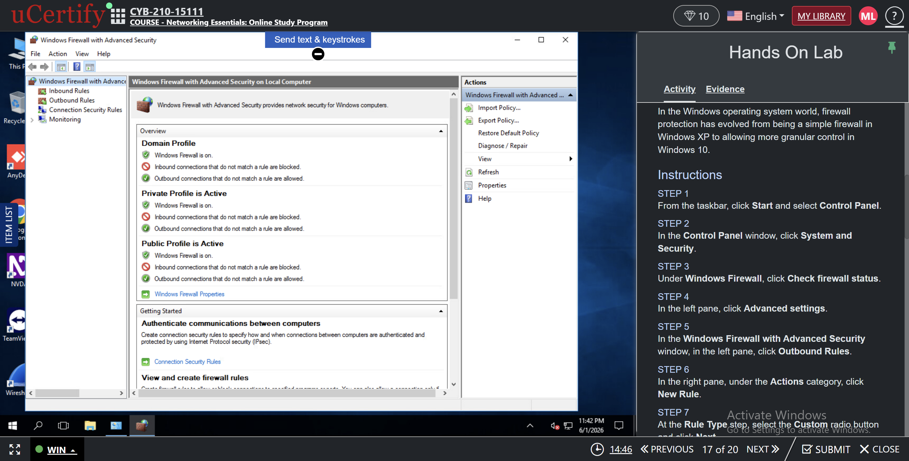
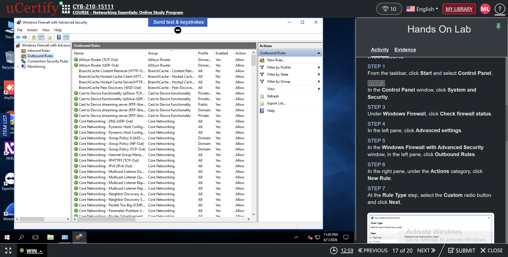
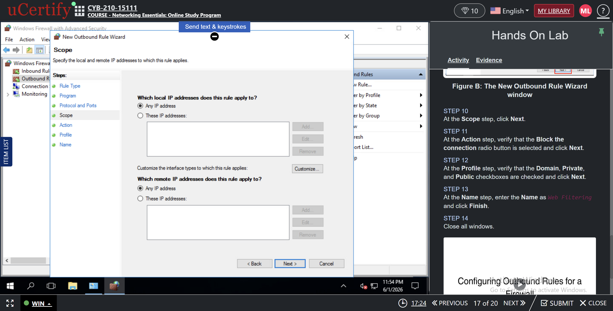
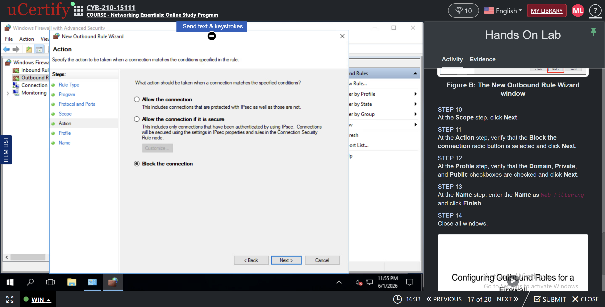
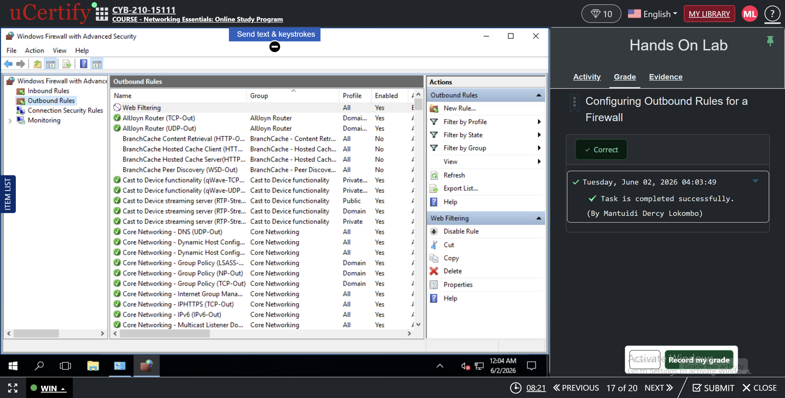

# Windows Firewall Outbound Rule Configuration Lab

## Project Overview

This project demonstrates how to configure outbound firewall rules using Windows Firewall with Advanced Security.

## Objective

Create a custom outbound rule to block web traffic on TCP ports 80 and 443.

## Tasks Performed

1. Opened Windows Firewall with Advanced Security.
2. Created a custom outbound rule.
3. Configured TCP protocol settings.
4. Specified remote ports 80 and 443.
5. Applied scope settings.
6. Selected Block the Connection.
7. Applied the rule to Domain, Private, and Public profiles.
8. Named the rule Web Filtering.
9. Verified the rule was successfully created.

## Skills Demonstrated

- Windows Firewall Administration
- Network Security
- Traffic Filtering
- Firewall Rule Management
- Port-Based Access Control
- Windows Security Configuration

## Screenshots

### 1. Lab Overview

### 2. Windows Firewall Status

### 3. Windows Firewall with Advanced Security

### 4. Outbound Rules Selected

### 5. Protocol and Ports Configuration
.png)

### 6. Scope Configuration

### 7. Block the Connection Action

### 8. Profile Selection
.png)

### 9. Rule Name (Web Filtering)
.png)

### 10. Completed Rule in Outbound Rules

